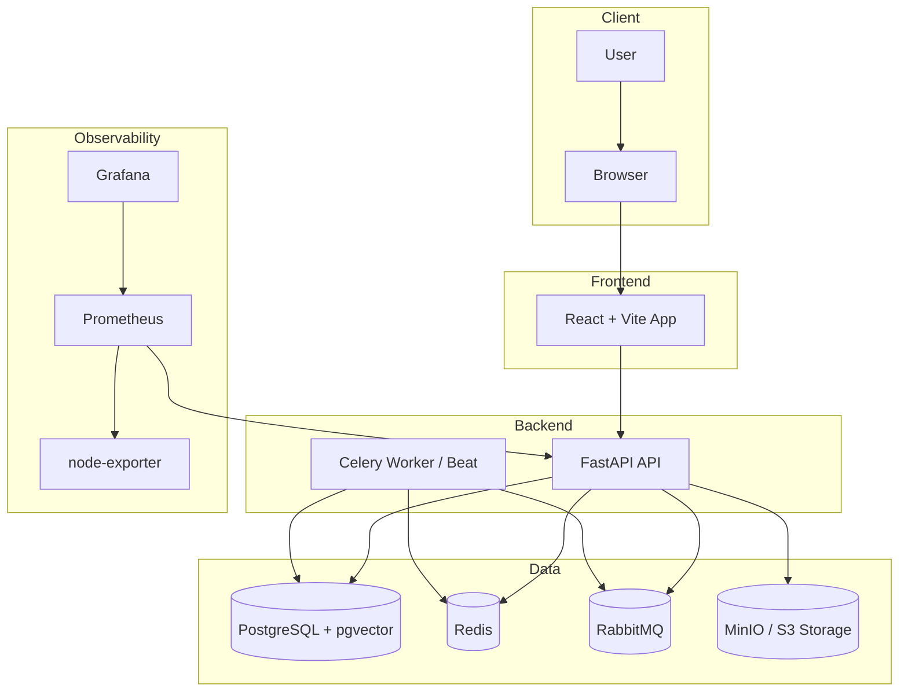

# 🚀 CRM Платформа (Tables + Knowledge Base + Schedule + Reports + AI)

Мультитенантная CRM/SaaS-платформа: конструктор таблиц (в стиле Airtable), база знаний (в стиле Notion), расписание, отчеты/дашборды, AI-агент.

## 🧭 Навигация

- 📦 **Backend**: `backend/` (FastAPI + SQLAlchemy async)
- 🖥️ **Frontend**: `frontend/` (React + Vite + TS)
- 📈 **Monitoring**: `monitoring/` (Prometheus + Grafana)
- 🌐 **Nginx (prod)**: `nginx/`
- 🐳 **Compose**: `docker-compose.yml` (dev), `docker-compose.prod.yml` (prod)

## 🧩 Сервисы и связи



## ⚡ Быстрый старт (dev)

### 1) Секреты

1. Скопируй `secrets.yml.example` → `secrets.yml`
2. Заполни значения в `secrets.yml`
3. Убедись, что `secrets.yml` не коммитится (он в `.gitignore`)

### 2) Запуск

```bash
docker compose -f docker-compose.yml -f secrets.yml up -d --build
```

### 3) Полезные URL

- 🖥️ Frontend: `http://localhost:5173`
- ⚙️ API: `http://localhost:8000`
- 🧾 Swagger UI: `http://localhost:8000/api/docs`
- 📄 OpenAPI JSON: `http://localhost:8000/api/openapi.json`
- ✅ Health: `http://localhost:8000/api/health`
- 🚦 Readiness: `http://localhost:8000/api/readiness`
- 📈 Metrics: `http://localhost:8000/metrics`
- 📈 Prometheus: `http://localhost:9090`
- 📊 Grafana: `http://localhost:3000`
- 🐇 RabbitMQ UI: `http://localhost:15672`
- 🗂️ MinIO: `http://localhost:9001`

## 🏭 Запуск (prod)

```bash
docker compose -f docker-compose.prod.yml -f secrets.yml up -d --build
```

Примечание: в prod используется `nginx` и сертификаты (см. `docker-compose.prod.yml`, `nginx/`, `certbot`).

## 🔌 API Контракты (кратко)

Базовый префикс: `GET/POST/PATCH/DELETE /api/v1/...`

Источник правды по контрактам: **OpenAPI**  
- `GET /api/openapi.json`
- `GET /api/docs`

### 🔐 Auth
- `POST /api/v1/auth/register` — регистрация
- `POST /api/v1/auth/login` — логин
- `POST /api/v1/auth/refresh` — обновление токена
- `POST /api/v1/auth/logout` — выход
- `GET /api/v1/auth/me` — текущий пользователь

### 🏢 Организации
- `GET /api/v1/orgs/current` — текущая организация
- `GET /api/v1/orgs/my` — мои организации
- `POST /api/v1/orgs/switch` — переключить организацию
- `GET /api/v1/orgs/members` — участники
- `GET/POST /api/v1/orgs/invites` — приглашения
- `POST /api/v1/orgs/invites/accept` — принять приглашение

### 🧱 Таблицы
- `GET/POST /api/v1/tables/` — список/создание таблиц
- `GET/PATCH/DELETE /api/v1/tables/{table_id}` — таблица
- `POST /api/v1/tables/{table_id}/columns` — создать колонку
- `PATCH/DELETE /api/v1/tables/{table_id}/columns/{column_id}` — колонка
- `GET/POST /api/v1/tables/{table_id}/records/` — записи
- `GET/PATCH/DELETE /api/v1/tables/{table_id}/records/{record_id}` — запись
- `POST /api/v1/tables/{table_id}/records/{record_id}/move` — перемещение записи
- `GET /api/v1/tables/{table_id}/export/csv` — экспорт CSV
- `GET /api/v1/tables/{table_id}/export/xlsx` — экспорт Excel
- `POST /api/v1/tables/{table_id}/import/csv` — импорт CSV

### 📚 База знаний
- `GET/POST /api/v1/knowledge/pages` — страницы
- `GET/PATCH/DELETE /api/v1/knowledge/pages/{page_id}` — страница

### 📅 Расписание
- `GET/POST /api/v1/schedule/events` — события
- `GET/PATCH/DELETE /api/v1/schedule/events/{event_id}` — событие

### 📊 Отчеты/дашборды
- `GET /api/v1/reports/summary` — сводка
- `GET /api/v1/reports/table-analytics` — аналитика по таблице
- `GET /api/v1/reports/timeline` — временная шкала
- `GET/POST /api/v1/reports/dashboards` — дашборды
- `GET/PATCH/DELETE /api/v1/reports/dashboards/{dashboard_id}` — дашборд
- `POST /api/v1/reports/dashboards/{dashboard_id}/widgets` — виджеты
- `PATCH/DELETE /api/v1/reports/dashboards/{dashboard_id}/widgets/{widget_id}` — виджет
- `GET /api/v1/reports/dashboards/{dashboard_id}/data` — данные для дашборда

### 🤖 AI
- `POST /api/v1/ai/chat` — чат
- `GET /api/v1/ai/status` — статус
- `GET /api/v1/ai/usage` — использование
- `GET/POST /api/v1/ai/chats` — чаты
- `DELETE /api/v1/ai/chats/{chat_id}` — удалить чат
- `GET /api/v1/ai/chats/{chat_id}/messages` — сообщения
- `POST /api/v1/ai/context-estimate` — оценка контекста/токенов
- `GET /api/v1/ai/context-sources` — доступные источники контекста

### 🛡️ Доступы (RBAC/Rules)
- `GET/POST /api/v1/access/rules` — правила
- `PATCH/DELETE /api/v1/access/rules/{rule_id}` — правило

### 👑 Superadmin
- `POST /api/v1/superadmin/login` — вход
- `GET /api/v1/superadmin/dashboard` — метрики/сводка
- `GET /api/v1/superadmin/orgs` — организации
- `GET /api/v1/superadmin/users` — пользователи
- `GET /api/v1/superadmin/tables` — таблицы
- `GET /api/v1/superadmin/ai-usage` — AI usage
- `PATCH /api/v1/superadmin/orgs/{org_id}/plan` — тариф
- `GET/PATCH /api/v1/superadmin/ai-config` — конфиг AI (глобально)

## 📈 Наблюдаемость

### Prometheus
- Prometheus скрейпит:
  - `api:8000/metrics` (метрики приложения + HTTP)
  - `node-exporter:9100/metrics` (CPU/RAM/диск/сеть; в Docker Desktop это “взгляд контейнера”)
- Загружает alert rules из `monitoring/alerts/*.yml`
- Ключевые метрики уведомлений:
  - `crm_notification_email_send_total{kind,status}` — отправка email (sent/failed/disabled)
  - `crm_invite_email_validation_total{result}` — результаты предвалидации инвайтов

### Grafana
- Datasource уже provisioned: Prometheus (`monitoring/grafana/provisioning/datasources/prometheus.yml`)
- Если нужны готовые dashboards, их можно добавить в provisioning (`monitoring/grafana/provisioning/dashboards`)

## 🧰 Полезные команды

```bash
# Статус контейнеров
docker compose -f docker-compose.yml -f secrets.yml ps

# Логи конкретного сервиса
docker compose -f docker-compose.yml -f secrets.yml logs -f api

# Пересборка и перезапуск
docker compose -f docker-compose.yml -f secrets.yml up -d --build
```

## 🧪 Makefile команды

Если у тебя установлен GNU Make (и ты запускаешь из Git Bash / WSL), можно короче:

```bash
make init
make up
make logs-api
make ps
```
