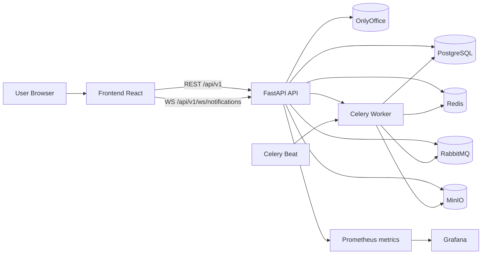
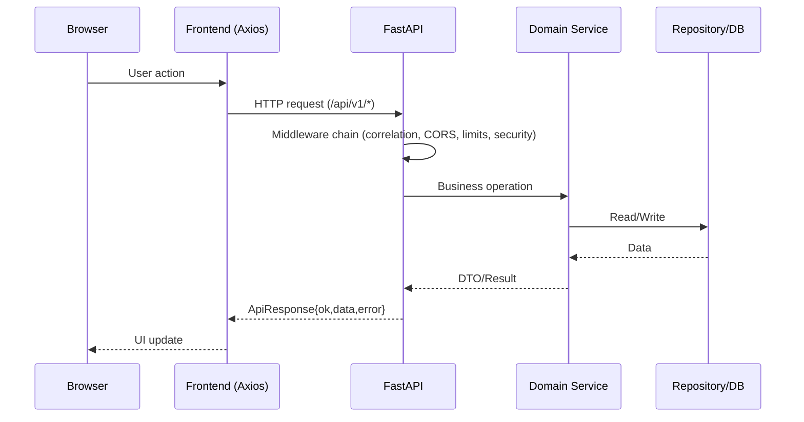
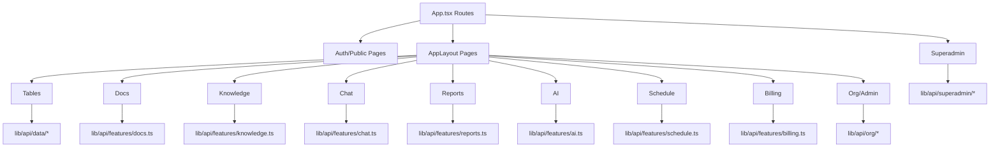
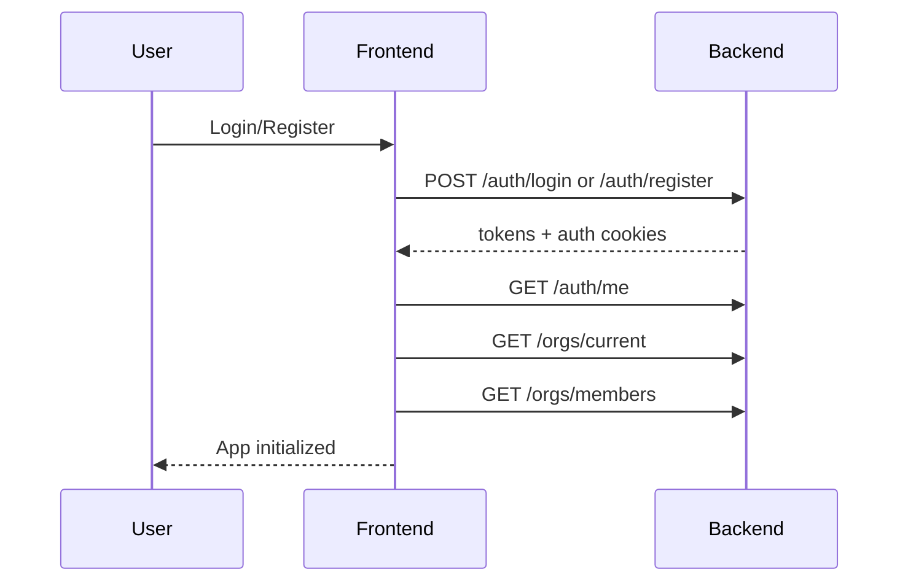
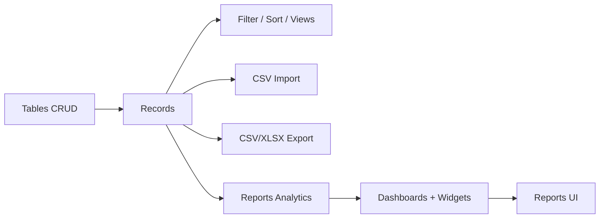
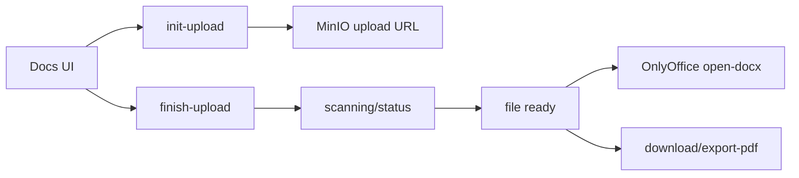

# CRM AI: Детальный анализ backend, frontend и API-контрактов

Версия: 1.0  
Дата: 26 мая 2026

## 1. Executive summary

Проект представляет собой мультитенантную CRM-платформу с модульной доменной архитектурой:
- Backend: FastAPI + SQLAlchemy + Alembic + Celery + Redis + RabbitMQ + MinIO.
- Frontend: React + TypeScript + Vite + Axios + Radix UI + TanStack Query/Virtual.
- Протоколы: REST (`/api/v1/*`) + WebSocket (`/api/v1/ws/notifications`).
- Контуры: dev/prod docker-compose, мониторинг через Prometheus/Grafana.

Ключевые сильные стороны:
- Четкое разделение модулей по доменам (`auth`, `org`, `tables`, `docs`, `chat`, `ai`, `billing`, ...).
- Единый envelope ответов API (`ApiResponse`).
- Production middleware: correlation id, security headers, trusted hosts, rate limit, request size limit.
- Развитый superadmin-контур.

Ключевые риски:
- `README.md` до этого был слишком кратким относительно реальной сложности системы.
- CI временно не запускает полный backend pytest (есть явный TODO в workflow).
- API surface большой; без регулярной контрактной проверки возможен drift между frontend типами и backend схемами.

## 2. Технологический стек и инфраструктура

## 2.1 Runtime-компоненты

- `frontend` (Vite/React build в prod через Nginx-контейнер)
- `api` (FastAPI)
- `celery_worker`
- `celery_beat`
- `db` (PostgreSQL + pgvector)
- `redis`
- `rabbitmq`
- `minio` (S3-compatible storage)
- `onlyoffice`
- observability (опционально профиль `infra-debug`): Prometheus, Grafana, node-exporter

## 2.2 Визуальная схема контуров

## 2.3 Жизненный цикл запроса

## 3. Backend: архитектурный анализ

## 3.1 Слои backend

- `src/main.py`: создание FastAPI app, middleware, health/readiness.
- `src/router.py`: композиция роутеров всех модулей под `/api/v1`.
- `src/modules/*`: доменные bounded-context модули.
- `src/infrastructure/*`: db, redis, celery, logging, metrics, cache.
- `src/common/*`: исключения, схемы, optimistic lock, soft delete, pagination.
- `src/middleware/*`: security/correlation/error/rate-limit/request-size/csrf hooks.

## 3.2 Каталог backend модулей

| Модуль | Назначение | API endpoints |
|---|---|---:|
| `auth` | регистрация/логин/refresh/профиль | 10 |
| `org` | организация, участники, роли, invite-flow, AI лимиты | 14 |
| `audit` | журнал действий | 1 |
| `access` | ACL-правила доступа на ресурсы | 4 |
| `tables` | таблицы, колонки, записи, views, import/export CSV/XLSX | 34 |
| `docs` | дерево документов, upload, версии, AI генерация, onlyoffice callback | 26 |
| `files` | общий файловый модуль | 4 |
| `knowledge` | страницы базы знаний | 5 |
| `reports` + `reports/v2` | аналитика, dashboards, widgets, preview | 17 |
| `chat` | чаты, сообщения, участники, вложения, read cursor, telemetry | 19 |
| `notifications` | уведомления + websocket канал | 5 (вкл WS) |
| `schedule` | события календаря + reminders dispatch | 6 |
| `ai` | AI chat, context estimate/sources, AI сессии | 9 |
| `billing` | планы, подписка, платежи, токены, webhooks | 10 |
| `superadmin` | управление платформой, org/tools/billing/AI runtime | 32 |

## 3.3 Наблюдения по backend

- Архитектурно модули в основном соответствуют паттерну `routes/schemas/service/repository`.
- Сильно выражен multi-tenant подход через `org` и role checks (`require_org`, `require_roles`, `require_superadmin`).
- Для production включены строгие middleware и health/readiness endpoints.
- В конфиге реализован контракт окружения + runtime mutable secrets (`config_contract.py`).

## 4. Frontend: архитектурный анализ

## 4.1 Маршруты UI (верхний уровень)

Основные роуты из `frontend/src/App.tsx`:
- Auth/Public: `/landing`, `/login`, `/register`, `/auth/*`, `/privacy-policy`, `/personal-data-consent`, `/product/:slug`, `/company/:slug`, `/legal/:slug`
- Core app (`AppLayout`): `/dashboard`, `/members`, `/audit`, `/settings`, `/tables`, `/tables/:tableId`, `/docs`, `/knowledge`, `/chat`, `/schedule`, `/reports-v2`, `/guide`, `/ai`, `/admin`, `/billing`, `/billing/success`, `/plans`
- Superadmin: `/superadmin`

## 4.2 Структура frontend модулей

- `pages/*`: экранные контейнеры по доменам.
- `components/*`: повторно используемые UI/feature компоненты.
- `contexts/*`: `AuthContext`, `ThemeContext`.
- `lib/api/*`: API-клиенты по доменным зонам.
- `lib/featureFlags.ts`: runtime фичефлаги на клиенте.

## 4.3 API-клиент frontend

- Базовый клиент: `frontend/src/lib/api/core/client.ts`
- Base URL: `/api/v1`
- `withCredentials: true` (cookie auth)
- request interceptor: `Accept-Language`
- response interceptor: auto-refresh при `401` через `/auth/refresh`

## 4.4 Визуальная схема frontend-domain map

## 5. API-контракты: фактическая карта

Ниже перечислены группы контрактов по backend модулю (итоговые пути с учетом `/api/v1`).

## 5.1 Auth (`/api/v1/auth/*`)

- `POST /register`
- `POST /register/request`
- `POST /register/confirm`
- `POST /login`
- `POST /refresh`
- `POST /logout`
- `GET /me`
- `PATCH /me`
- `POST /forgot-password`
- `POST /reset-password`

## 5.2 Organizations (`/api/v1/orgs/*`)

- `GET /current`, `PATCH /current`, `DELETE /current`
- `GET /my`, `POST /switch`
- `GET /members`, `PUT /members/{membership_id}/role`, `DELETE /members/{membership_id}`
- `POST /invites`, `POST /invites/accept`, `POST /invites/{invite_id}/resend`
- `GET /ai/limits`, `PATCH /ai/limits`, `PUT /ai/limits/users/{user_id}`

## 5.3 Access + Audit

- Access: `/api/v1/access/rules` (`GET/POST/PATCH/DELETE`)
- Audit: `/api/v1/audit/logs` (`GET`)

## 5.4 Tables (`/api/v1/tables/*`)

Core:
- folders CRUD: `/tables/folders/*`
- tables CRUD: `/tables/*`
- columns CRUD: `/tables/{table_id}/columns/*`
- formula preview, relation options

Records:
- `/tables/{table_id}/records/*` CRUD
- move, bulk-update, bulk-delete
- history + rollback

Views:
- `/tables/{table_id}/views/*` CRUD

Import/Export/Query:
- `POST /tables/{table_id}/filter`
- `GET /tables/{table_id}/export/csv`
- `GET /tables/{table_id}/export/xlsx`
- `POST /tables/{table_id}/import/csv`
- `POST /tables/{table_id}/import/csv/preview`
- `POST /tables/{table_id}/import/csv/commit`

## 5.5 Docs (`/api/v1/docs/*`)

- tree/folders CRUD
- files upload pipeline: `init-upload`, `finish-upload`, `abort-upload`
- file operations: `get`, `save-text`, `versions`, `download`, `export-pdf`, `delete`
- onlyoffice callback
- AI generation jobs CRUD/control
- usage

## 5.6 Knowledge / Files / Schedule

Knowledge:
- `/knowledge/pages` CRUD

Files:
- `/files/upload`
- `/files/`
- `/files/{file_id}/download`
- `/files/{file_id}`

Schedule:
- `/schedule/events` CRUD
- `/schedule/events/dispatch-reminders`

## 5.7 Reports + Reports v2

Reports:
- summary/timeline/schema/analytics preview
- dashboards CRUD
- widgets CRUD
- dashboard data/preview

Reports v2:
- semantic schema
- unified preview

## 5.8 Chat + Notifications

Chat:
- chats CRUD
- members add/list
- messages list/send/delete
- attachments init/finish/abort/download-url
- presence, typing, read cursor
- client-config, telemetry

Notifications:
- list
- unread-count
- mark-read / mark-all-read
- websocket stream: `/api/v1/ws/notifications`

## 5.9 AI

- `/ai/chat`
- `/ai/status`
- `/ai/usage`
- `/ai/chats` list/create/delete
- `/ai/chats/{chat_id}/messages`
- `/ai/context-estimate`
- `/ai/context-sources`

## 5.10 Billing

- `/billing/plans`, `/billing/usage`, `/billing/subscription`
- `/billing/create-payment`, `/billing/payments/{payment_id}`
- `/billing/tokens/balance`, `/billing/tokens/packages`, `/billing/tokens/purchase`
- `/billing/cancel-subscription`
- `/billing/webhook/yookassa` (service endpoint)

## 5.11 Superadmin (`/api/v1/superadmin/*`)

Включает:
- auth/profile
- org catalog, members, delete jobs
- AI config + usage controls
- billing plan/token/yookassa runtime config
- audit logs
- org tables read/export tools

Всего: 32 endpoints.

## 6. Контрактные принципы API

## 6.1 Формат ответа

Практически везде используется общий envelope:
- `ok: boolean`
- `data: T | null`
- `error: { code, message, ... } | null`

## 6.2 Аутентификация

- Cookie-based auth в основном контуре (`access` + `refresh` cookies).
- Refresh flow инициируется frontend interceptor при `401`.
- Отдельный cookie-контур для superadmin.

## 6.3 Локализация

- Клиент передает `Accept-Language`.
- В auth/org flow это используется для email/locale-сценариев.

## 6.4 Realtime

- WS endpoint для уведомлений.
- Chat realtime дополняется REST синхронизацией (history/backfill/read-cursor).

## 7. End-to-end логика проекта (визуально)

## 7.1 Auth + org bootstrap

## 7.2 Data workflow (Tables -> Reports)

## 7.3 Docs workflow

## 8. Gap-analysis и рекомендации

## 8.1 Что хорошо

- Доменная декомпозиция бэка.
- Наличие middleware уровня production.
- Хорошая покрываемость функциональных доменов на фронте.
- Реальные enterprise-подсистемы: billing, superadmin, audit, AI runtime config.

## 8.2 Критичные улучшения

1. Контрактное тестирование API:
- Добавить автогенерацию/валидацию OpenAPI snapshot в CI.
- Проверять совместимость frontend типов с backend schema.

2. Полный backend test gate в CI:
- Сейчас pytest-фаза временно отключена; вернуть обязательный прогон.

3. Документация модулей:
- Для каждого модуля добавить короткий `README` со схемой `routes -> service -> repo`.

4. Наблюдаемость:
- Зафиксировать стандарт dashboard/alerts для всех критичных модулей (не только chat).

5. Performance governance:
- SLO по endpoint группам (auth/tables/chat/docs/reports).
- Регулярный slow-query audit.

## 8.3 Приоритетный roadmap документации

Sprint D0:
- Обновить root `README`.
- Зафиксировать текущую API карту (этот документ).

Sprint D1:
- Добавить модульные README для `tables/docs/chat/reports`.
- Добавить диаграммы sequence по критичным сценариям.

Sprint D2:
- Ввести договор на versioning API и deprecation policy.
- Ввести автоматизированную проверку backward compatibility.

## 9. Reference files

Backend:
- `backend/src/main.py`
- `backend/src/router.py`
- `backend/src/modules/*`
- `backend/src/config_contract.py`

Frontend:
- `frontend/src/App.tsx`
- `frontend/src/lib/api/**/*`
- `frontend/src/pages/**/*`

Infra/CI:
- `docker-compose.yml`
- `docker-compose.prod.yml`
- `.github/workflows/ci.yml`

