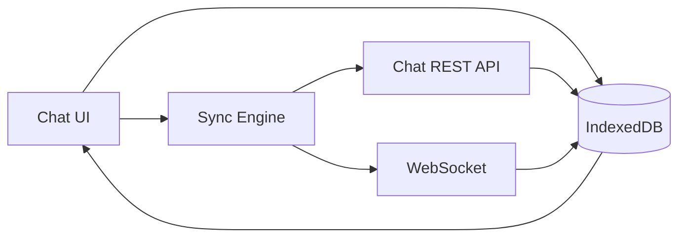
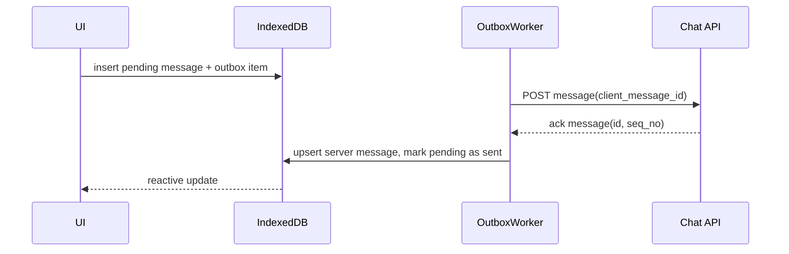
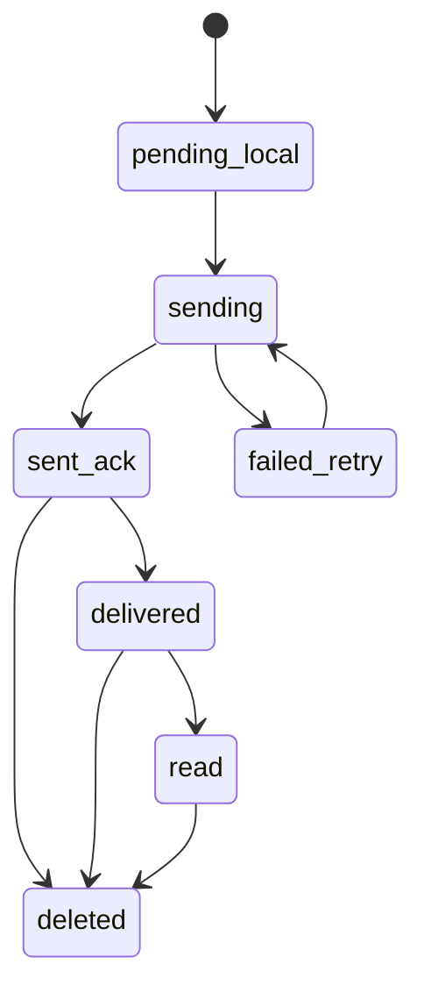

# ТЗ: Мессенджер CRM AI уровня Telegram/WhatsApp

Версия: 1.0  
Дата: 26 мая 2026  
Контур: `crm.py-it.ru`  
Цель: поведение чата как в Telegram/WhatsApp при открытии, скролле, reconnect, офлайне и работе с медиа.

## 1. Цель и критерии успеха

Система должна:
- открывать чат мгновенно из локального persistent-кэша;
- догружать с сервера только дельту, а не полную историю;
- не терять сообщения при обрывах сети/refresh;
- не дублировать сообщения при одновременном WS + HTTP;
- минимизировать повторные запросы на медиа (фото/видео/ГС/файлы).

Критерии успеха:
- первое отображение списка сообщений после входа в чат: P95 <= 250мс (из локального кэша);
- после reconnect: восстановление дельты сообщений <= 2с при нормальной сети;
- потеря сообщений: 0;
- дубли в ленте: 0;
- повторные загрузки медиа для уже открытого контента: минимальные, управляемые политикой кэша.

## 2. Область работ

Входит:
- клиентский persistent-кэш сообщений и медиа;
- синхронизация по `after_seq_no` / `before_seq_no`;
- outbox и идемпотентная отправка;
- восстановление после reconnect/offline/refresh;
- политика хранения и очистки медиа;
- метрики/алерты/rollout.

Не входит:
- E2E encryption;
- federation между инсталляциями;
- аудио/видео звонки.

## 3. Проблема текущего состояния

Сейчас:
- часть кэша находится только в памяти вкладки;
- при refresh кэш сбрасывается;
- история при входе в чат запрашивается снова;
- `download-url` кешируется временно, но это не persistent storage;
- для UX уровня мессенджера этого недостаточно.

## 4. Целевые принципы

1. Локальная БД клиента (IndexedDB) — первичный источник для рендера.
2. Сервер — источник истины; клиент периодически и по событиям синхронизируется дельтой.
3. Идемпотентность отправки обязательна (`client_message_id`).
4. Событийная модель: WS для realtime, HTTP для backfill/истории.
5. Дедупликация на всех входах (WS/HTTP/outbox ack).
6. Медиа кэшируется отдельно от метаданных сообщений.

## 5. UX-сценарии (обязательные)

## 5.1 Открытие чата

Ожидаемое поведение:
- мгновенно показать последние сообщения из IndexedDB;
- сразу запустить фоновый sync по `after_seq_no` от последнего локального `seq_no`;
- при наличии новых сообщений мягко добавить в конец.

## 5.2 Скролл вверх (история)

Ожидаемое поведение:
- при подходе к верху сначала читать из локального архива;
- при нехватке локальных записей запрашивать `before_seq_no`;
- сохранять anchor scroll (без “скачка” позиции).

## 5.3 Новые сообщения

Ожидаемое поведение:
- новые сообщения приходят по WS;
- если пользователь внизу, автоскролл;
- если не внизу, счетчик “N новых”.

## 5.4 Reconnect / offline

Ожидаемое поведение:
- после восстановления WS выполнить backfill `after_seq_no`;
- гарантировать целостность диапазона seq;
- outbox повторяет pending-отправки без дублей.

## 5.5 Медиа и голосовые

Ожидаемое поведение:
- при открытии сообщения сначала проверка локального blob-кэша;
- если blob нет, получить `download-url`, скачать, сохранить локально;
- последующие открытия — без повторной сетевой загрузки (пока не сработает GC).

## 6. Архитектура клиента

## 6.1 Хранилище

Использовать `IndexedDB` (рекомендуется `Dexie`).

Таблицы:
- `chat_meta`
- `message`
- `message_index` (опционально для ускорения выборок)
- `attachment_meta`
- `attachment_blob`
- `outbox`
- `sync_state`
- `cache_gc_state`

## 6.2 Схема таблиц (минимум)

`chat_meta`:
- `chat_id` (PK)
- `last_local_seq_no`
- `last_server_seq_no`
- `last_sync_at`
- `unread_local_count`

`message`:
- `id` (PK, server UUID)
- `chat_id` (index)
- `seq_no` (compound unique: `chat_id + seq_no`)
- `client_message_id` (index)
- `sender_id`
- `body`
- `body_type`
- `meta_json`
- `created_at`
- `updated_at`
- `delivery_state` (`pending|sent|delivered|read|failed`)
- `is_deleted`

`attachment_meta`:
- `file_id` (PK)
- `chat_id` (index)
- `message_id` (index)
- `mime`
- `size_bytes`
- `sha256` (if available)
- `local_blob_key` (nullable)
- `remote_download_url_expires_at` (nullable)

`attachment_blob`:
- `blob_key` (PK)
- `file_id` (index)
- `blob`
- `size_bytes`
- `cached_at`
- `last_access_at`

`outbox`:
- `client_message_id` (PK)
- `chat_id`
- `payload_json`
- `attachments_json`
- `attempt_count`
- `next_retry_at`
- `status` (`pending|sending|acked|failed`)
- `last_error`
- `created_at`

`sync_state`:
- `chat_id` (PK)
- `last_contiguous_seq_no`
- `last_backfill_at`
- `ws_connected_at`
- `last_reconnect_at`

## 6.3 Потоки данных (визуально)

## 7. Серверные контракты

## 7.1 История и дельта

`GET /api/v1/chat/chats/{chat_id}/messages`

Параметры:
- `limit` (обяз.)
- `before_seq_no` (для истории вверх)
- `after_seq_no` (для дельты после reconnect/refresh)
- `latest=true` (последняя страница)

Гарантии ответа:
- строгая сортировка по `seq_no ASC`;
- отсутствие дыр внутри возвращаемого диапазона;
- стабильная пагинация.

## 7.2 Идемпотентная отправка

`POST /api/v1/chat/chats/{chat_id}/messages`

Тело:
- `client_message_id` (обязателен)
- `body`, `body_type`, `meta`

Поведение:
- повтор с тем же `client_message_id` возвращает тот же серверный message;
- сервер не создает дубликаты.

## 7.3 Read cursor

`POST /api/v1/chat/chats/{chat_id}/read-cursor`
- принимает `last_read_seq_no`
- обновление монотонное (уменьшать нельзя).

## 7.4 Вложения

- `POST /attachments/init-upload`
- `POST /attachments/finish-upload`
- `GET /attachments/{file_id}/download-url`

`download-url` может быть краткоживущим и не является persistent-кэшем контента.

## 8. Алгоритмы синхронизации

## 8.1 Open chat algorithm

1. Прочитать последние N сообщений из IndexedDB.
2. Отрендерить UI сразу.
3. В фоне запросить `after_seq_no = last_local_seq_no`.
4. Применить дельту транзакционно.
5. Обновить `sync_state.last_contiguous_seq_no`.

## 8.2 WS message algorithm

1. Приходит `chat.message.created`.
2. Проверка дедупа:
- `message.id` уже существует -> skip.
- либо `chat_id + seq_no` уже существует -> skip.
3. Записать сообщение в IndexedDB.
4. Обновить UI.
5. Если есть разрыв seq, немедленно запуск backfill `after_seq_no`.

## 8.3 Reconnect algorithm

1. WS reconnect событие.
2. Получить `after_seq_no = last_contiguous_seq_no`.
3. Запросить дельту.
4. Закрыть дыры, обновить state.
5. Отправить метрику `ws_reconnect` и `message_lag`.

## 8.4 Outbox algorithm

1. При send:
- создать локальное `pending` сообщение;
- записать в `outbox`.
2. Worker отправляет на сервер.
3. При ack:
- upsert серверного сообщения;
- связать с `client_message_id`;
- удалить/закрыть запись outbox.
4. Retry по backoff: `1s, 2s, 5s, 10s, 30s, 60s`, max N попыток.

## 8.5 History up algorithm

1. Пользователь скроллит вверх.
2. Попытка взять предыдущий сегмент из локальной БД.
3. Если локально пусто — `before_seq_no` запрос.
4. Сохранить в БД.
5. Восстановить scroll anchor.

## 9. Кэш медиа и ГС

## 9.1 Политика

- `download-url` кэшировать только как технический ephemeral.
- Фактический контент (blob) хранить в `attachment_blob`.
- Ключ blob: `file_id` или `sha256`.

## 9.2 Cache control

- лимит хранилища на пользователя/tenant policy (например, 500MB);
- LRU eviction;
- отдельные лимиты на типы (`audio`, `video`, `image`, `file`);
- manual clear в настройках клиента.

## 9.3 Privacy

- при logout очищать sensitive caches;
- опционально “не кэшировать файлы > X MB”;
- шифрование локального кэша по политике продукта (опционально).

## 10. Производительность и масштаб

Требования:
- длинные чаты (10k+ сообщений) без деградации UI;
- виртуализация списка сообщений обязательна;
- чтение из IndexedDB пакетами;
- тяжелые операции выносить из main-thread (Web Worker, где нужно);
- debounce для поисковых/фильтровых запросов.

SLO:
- P95 open chat from cache <= 250ms.
- P95 delta sync <= 900ms (до 100 сообщений).
- P95 media open (cached) <= 100ms.

## 11. Безопасность

Обязательно:
- RBAC на каждый endpoint;
- tenant isolation;
- server-side валидация membership;
- MIME/signature checks для вложений;
- antivirus pipeline;
- rate limit на отправку/загрузку;
- аудит удаления/редактирования сообщений.

## 12. Наблюдаемость

Метрики:
- `chat_cache_hit_ratio`
- `chat_cache_miss_ratio`
- `chat_sync_delta_count`
- `chat_sync_gap_repair_count`
- `chat_outbox_queue_size`
- `chat_outbox_retry_count`
- `chat_media_blob_cache_bytes`
- `chat_media_fetch_network_count`

Алерты:
- cache hit ratio < 70% (длительно)
- outbox retry burst
- reconnect rate spike
- message gap repair spike

## 13. Тестирование

## 13.1 Backend tests

- идемпотентная отправка по `client_message_id`;
- строгий порядок `after_seq_no/before_seq_no`;
- конкуренция отправок (20-50 параллельных);
- права на chat/messages/attachments.

## 13.2 Frontend tests

- unit: db adapters, dedup, merge, outbox retry;
- integration: open chat from cache, reconnect backfill;
- e2e:
- refresh без потери истории;
- offline send -> online ack;
- long scroll anchor stability;
- media reopen without extra network.

## 13.3 Нагрузочные сценарии

- 100 одновременных пользователей в одном чате;
- burst 500 новых сообщений;
- reconnect storm;
- медиа-чат с 1000 вложений.

## 14. План спринтов

## Sprint A: Foundation (Offline Core)

Сделать:
- IndexedDB schema + migrations;
- `sync_state` + basic sync engine;
- рендер чата из локального кэша.

Чеклист:
- [ ] Open chat без сети показывает кэш.
- [ ] Нет файлов > 600 строк среди новых модулей.
- [ ] lint + tsc + build проходят.

## Sprint B: Delta Sync + Reconnect

Сделать:
- полноценный `after_seq_no` backfill;
- repair gaps по seq;
- reconnect flow.

Чеклист:
- [ ] После reconnect нет дыр/дублей.
- [ ] Сообщения не теряются.
- [ ] Метрики reconnect/lag отдаются.

## Sprint C: Outbox + Idempotency

Сделать:
- persistent outbox;
- retry/backoff;
- reconcile pending -> acked.

Чеклист:
- [ ] offline send переживает refresh.
- [ ] Повторная отправка не дает дубль на сервере.
- [ ] Ошибки outbox наблюдаемы.

## Sprint D: Media/Voice Cache

Сделать:
- blob cache для attachments;
- LRU GC;
- lazy network fetch only on miss.

Чеклист:
- [ ] Повторное открытие медиа без network (cache hit).
- [ ] Управляемый размер локального кэша.
- [ ] Нет регрессий скачивания/просмотра.

## Sprint E: Hardening + Rollout

Сделать:
- perf tuning;
- chaos/reconnect tests;
- feature flag rollout.

Чеклист:
- [ ] SLO выдержаны.
- [ ] rollback план проверен.
- [ ] мониторинг 48ч после включения.

## 15. Definition of Done (Global)

- [ ] Поведение открытия/синка чата соответствует TG/WA паттерну.
- [ ] История/медиа кэшируются persistent, не только в RAM.
- [ ] Дельта-синк и outbox покрыты тестами.
- [ ] Наблюдаемость и алерты включены.
- [ ] CI зеленый по затронутым зонам.

## 16. Риски и контрмеры

Риск:
- IndexedDB quota exceeded.
Контрмера:
- LRU + размерные лимиты + UI-очистка кэша.

Риск:
- seq gap при перегруженном WS.
Контрмера:
- gap detector + aggressive backfill.

Риск:
- дубли при race WS/HTTP/outbox ack.
Контрмера:
- единый dedup keyset (`message_id`, `chat_id+seq_no`, `client_message_id`).

Риск:
- рост сложности клиентского sync engine.
Контрмера:
- четкие state machine, contract tests и telemetry.

## 17. Приложение: state machine сообщения

